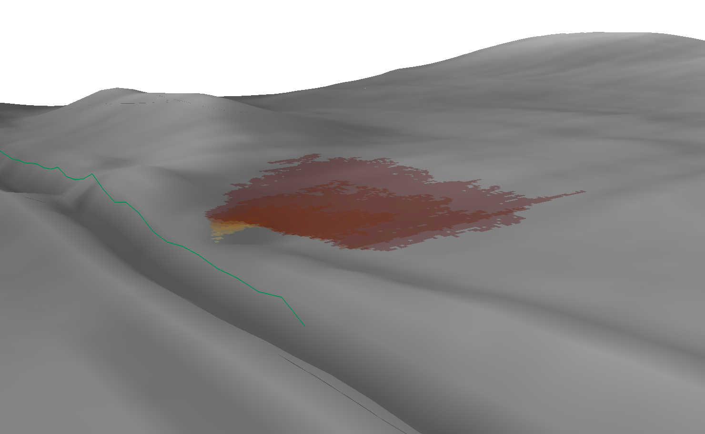

Introduction
============

Hypsometry plugin (SIAM) extracts polygons outlining DEM areas above
certain elevation containing points of interest. If you are interested
in hypsometric curve only, consider using dedicated hypsometry plugin
with restricting polygons.

This tools discards same elevation areas that do not contain point of
interest. This allows to accurately derive stage-area curves and
corresponding polygons but it has implication that volume calculated
from such curves may be underestimated if several smaller depressions
are around.

   Visualization of a ditch with output polygon slices offsetted above hillshaded
   DEM
