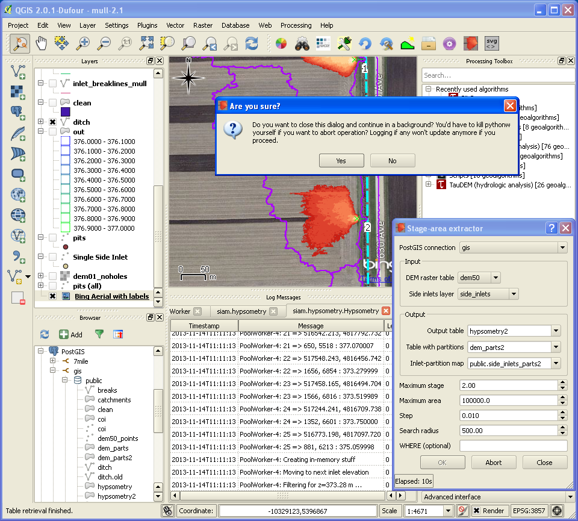

Usage
=====

0. Before using this plugin, set up `PostGIS 2+ <http://postgis.net>`_
   (1.x lacks support for rasters) if it is not done yet.
1. Import your DEM and points
2. Make reasonable assumptions on input parameters or accept defaults
3. Use SQL to check whether output polygons are `properly contained
   <http://postgis.org/docs/ST_ContainsProperly.html>`_ within partitions
   and/or don't `intersect
   <http://www.postgis.org/docs/ST_Intersects.html>`_ ditch etc.

You may consider adjusting logging configuration
(``~/.qgis2/python/plugins/siam/logging.conf``) to track down
possible issues. Note that logging to QGIS console is resource
intensive.

